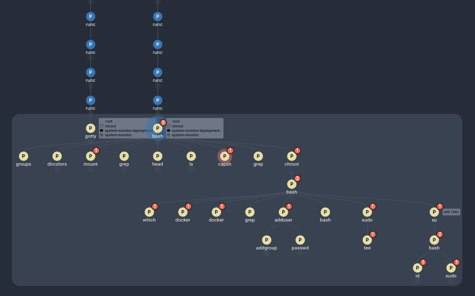

# Container Escape Using Chroot

## Running the Exploit

> This exploit is based on <a href="https://madhuakula.com/kubernetes-goat/docs/scenarios/scenario-4/container-escape-to-the-host-system-in-kubernetes-containers/welcome" target="_blank">a Kubernetes Goat scenario</a>, updated to be compatible with modern Kubernetes.

One of the assets we have added to the cluster is a system monitor that has more permissions than is really necessary. To start, visit [localhost:1233](http://127.0.0.1:1233/), which gives a shell interface for the system monitor pod. Ideally, this shell is restricted to the container. However, running `mount` reveals that there is a link to the host system:

```sh
mount
```

Within all of the mount entries, there is a `/host-system` folder that seems to link to the host machine. Additionally, running `capsh` shows that everything is unlocked - meaning we can run chroot:

```sh
capsh --print
```

```sh
chroot /host-system bash
```

Now, we are in the root of the host system, which gives us all kinds of access. From here we could install an ssh backdoor key in the known_hosts file, query the AWS IMDS service to impersonate the AWS node (if the cluster is hosted on AWS). If the node is configured correctly, we might even be able to get the kubelet's configuration file, located in the `/var/lib/kubelet` directory. Using the credentials inside, we might be able to get access to more of the cluster. For demonstration purposes, let's install a backdoor key into the node:

```sh
# if this were a real backdoor, we could put a real ssh public key here
echo 'ssh-rsa BACKDOOR_KEY eve@example.com' >> /root/.ssh/authorized_keys
```

## Investigating the Results

Performing this exploit will trigger a number of red flags which are detected and collected into a single Spydertrace object. In the Spyderbat Console, navigate to the Dashboard page. In the Security tab, under "Recent Spydertraces with Score > 50", a new trace should appear, likely named "command_gotty", "root_shell", or "container_escape_using_chroot...". Selecting this Spydertrace, we can select "Start Process Investigation" to see the events of the exploit layed out in a Causal Tree in the investigation view:



## Next Steps

Now that the vulnerable container has been identified and the scope of the resulting access determined, steps can be taken to end the existing access and update the pod configuration to remove the possibility of a chroot.

