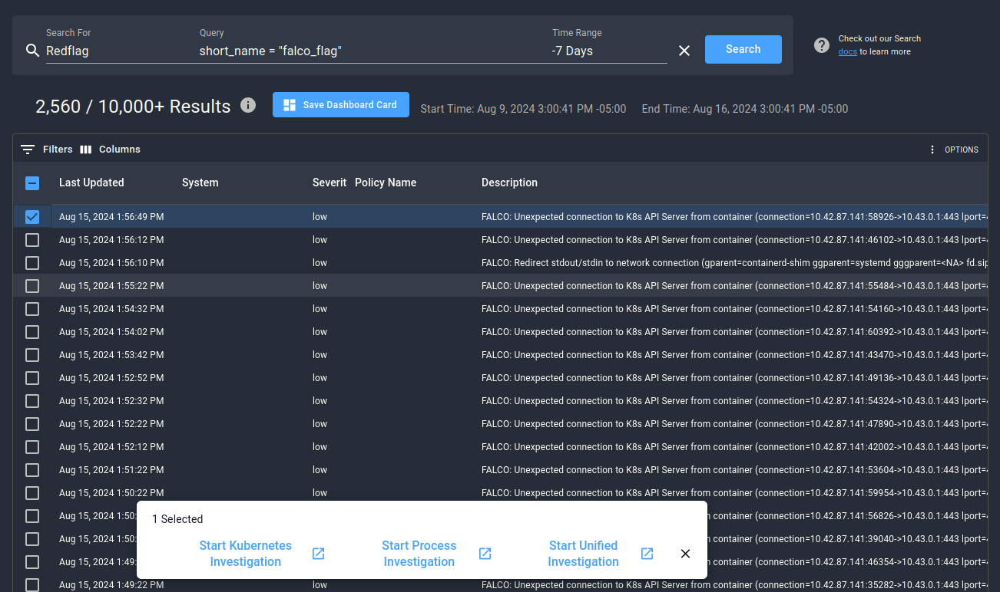
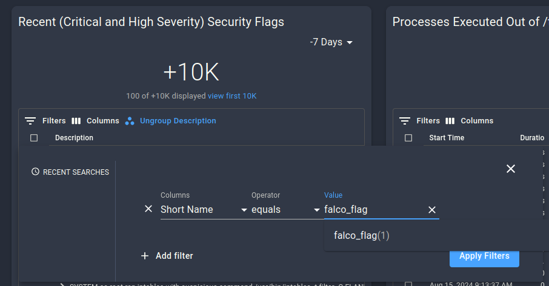
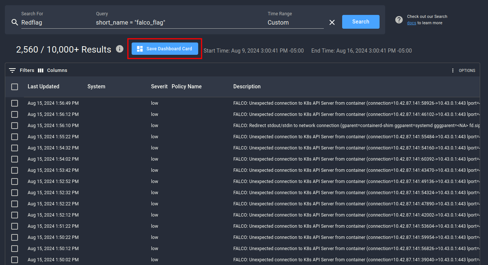

# Falco Event Generator Test

After installing the Spyderbat Falco integration, the Falco event generator can be used to test that the integration is working.

## Installation

If you have not already, make sure that you have installed Falco with the Spyderbat event forwarder integration. This can be done using the install script, or with the following command:

> **Note:**
>
> Make sure to set the SPYDERBAT_ORG and SPYDERBAT_API_KEY values for the Falco sidekick to access the Spyderbat API.

```sh
helm repo add falcosecurity https://falcosecurity.github.io/charts 
helm repo update
helm install falco falcosecurity/falco \
    --create-namespace \
    --namespace falco \
    --set falcosidekick.enabled=true \
    --set falcosidekick.config.spyderbat.orguid="SPYDERBAT_ORG" \
    --set falcosidekick.config.spyderbat.apiurl="https://api.spyderbat.com" \
    --set falcosidekick.config.spyderbat.apikey="SPYDERBAT_API_KEY" \
    --set extra.args=\{"-p","%proc.pid"\} \
    --set driver.kind=ebpf
```

Installing the event generator is then straightforward (if you added the falcosecurity repo in the above command):

```sh
helm install event-generator falcosecurity/event-generator
```

The event generator will take a few seconds to start triggering events, and will continue creating them at a rate of around one per second until uninstalled.

## Investigation


Once Falco starts detecting suspicious activity, respective “FALCO” labeled flags will be generated in the Spyderbat data stream and made visible in the Spydergraph Investigation section. These Flags can be located by running a search query. You will select the “Search” option in the left-hand navigation menu, run your search query, and then select a Flag you wish to investigate on a visual causal graph by checking the box and clicking “Start Investigation”:

```
short_name = "falco_flag"
```



If you do not see any results within a minute or so from starting the event generator, try some of the troubleshooting steps [below](#troubleshooting).

Once you click the “Start Investigation” button, you will be redirected to the Investigation page where you will be able to see the selected flags and all associated processes as well as other security content:


You can also locate these flags by applying filtering options to our default Flags Dashboard and selecting the flags to start an Investigation this way:





To stay on top of incoming Falco findings, you can create a custom dashboard card to pull in all Falco flags with desired severity by building the following search query for Redflag objects:

```
short_name = "falco_flag"
```

Once you have run your search, you can save the output as a custom dashboard card to be easily accessible through the UI:



Once you are done testing the event generator, don't forget to [clean it up](#clean-up).

## Troubleshooting

If you are not receiving any flags from the Falco event generator, the first possibility is that they have not been created yet. It may take a minute or two for the event generator to start, the flags to be generated by Falco, and then be processed by Spyderbat. If the flags still do not appear after this time, check the falco pod's logs:

```sh
kubectl logs -n falco $(kubectl get pods -n falco -l app.kubernetes.io/name=falco -o jsonpath='{.items[0].metadata.name}')
```

If you see an error like this:

```
# ...
Thu Aug 22 18:03:23 2024: One ring buffer every '2' CPUs.
libpman: ring buffer map type is not supported (errno: 22 | message: Invalid argument)
Thu Aug 22 18:03:23 2024: An error occurred in an event source, forcing termination...
Events detected: 0
Rule counts by severity:
Triggered rules by rule name:
Error: Initialization issues during scap_init
```

Try re-installing Falco with the kernel driver:

```sh
helm upgrade falco falcosecurity/falco \
    --create-namespace \
    --namespace falco \
    --set falcosidekick.enabled=true \
    --set falcosidekick.config.spyderbat.orguid="SPYDERBAT_ORG" \
    --set falcosidekick.config.spyderbat.apiurl="https://api.spyderbat.com" \
    --set falcosidekick.config.spyderbat.apikey="SPYDERBAT_API_KEY" \
    --set extra.args=\{"-p","%proc.pid"\}
```

Or with the modern eBPF probe:

```sh
helm upgrade falco falcosecurity/falco \
    --create-namespace \
    --namespace falco \
    --set falcosidekick.enabled=true \
    --set falcosidekick.config.spyderbat.orguid="SPYDERBAT_ORG" \
    --set falcosidekick.config.spyderbat.apiurl="https://api.spyderbat.com" \
    --set falcosidekick.config.spyderbat.apikey="SPYDERBAT_API_KEY" \
    --set extra.args=\{"-p","%proc.pid"\} \
    --set driver.kind=modern_ebpf
```

If the Falco pod is working, check that the sidekick pod has the right API values:

```sh
kubectl logs -n falco $(kubectl get pods -n falco -l app.kubernetes.io/name=falcosidekick -o jsonpath='{.items[0].metadata.name}') | head
```

If you see an error like this:

```
2024/08/21 21:29:40 [ERROR] : Spyderbat - HTTP error: 403 Forbidden
2024/08/21 21:29:40 [ERROR] : Spyderbat - client creation error
2024/08/21 21:29:40 [INFO]  : Falco Sidekick version: 2.29.0
2024/08/21 21:29:40 [INFO]  : Enabled Outputs : []
2024/08/21 21:29:40 [INFO]  : Falcosidekick is up and listening on :2801
```

It means the Spyderbat API configuration is incorrect. Check the values with:

```sh
helm get values falco -n falco
```

And make sure the values are correct, running an update command if they are not:

```sh
helm upgrade falco falcosecurity/falco \
    --create-namespace \
    --namespace falco \
    --set falcosidekick.enabled=true \
    --set falcosidekick.config.spyderbat.orguid="SPYDERBAT_ORG" \
    --set falcosidekick.config.spyderbat.apiurl="https://api.spyderbat.com" \
    --set falcosidekick.config.spyderbat.apikey="SPYDERBAT_API_KEY" \
    --set extra.args=\{"-p","%proc.pid"\} \
    --set driver.kind=modern_ebpf
```

If you are still having issues, please reach out to us for help! Ask a question on the [spyderbatcommunity Slack](https://spyderbatcommunity.slack.com/), or email us at [help@spyderbat.com](mailto:help@spyderbat.com).

## Clean up

The event generator can be uninstalled with Helm:

```sh
helm uninstall event-generator
```

## Further Reading

- [Check out our Cloud Detection and Response demos!](../cdr.md)
- [How to Set Up Spyderbat to Ingest Falco Alerts](https://docs.spyderbat.com/tutorials/integrations/falco-connector-deployment)
- [Falco Documentation](https://falco.org/docs/)

