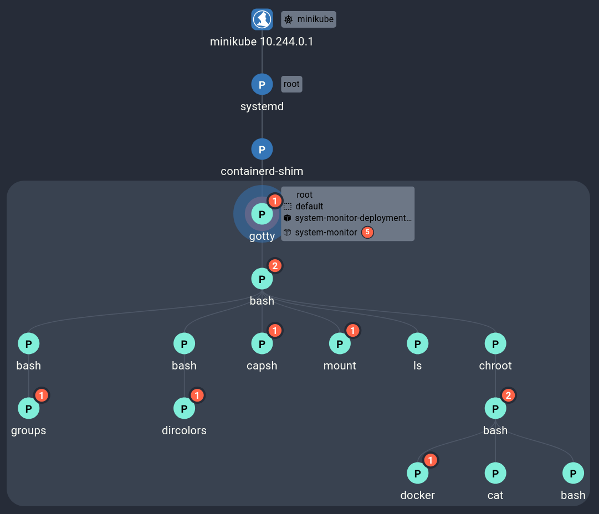

# Container Escape to the Host System

## Pre-Requisites

Make sure the cluster is running and your Kubectl configuration is set up to access the cluster. If not, follow [these steps](../getting-started.md) to get started.

## Running the Exploit

Follow the guide <a href="https://madhuakula.com/kubernetes-goat/docs/scenarios/scenario-4/container-escape-to-the-host-system-in-kubernetes-containers/welcome" target="_blank">in the Kubernetes Goat documentation</a>.

Note: the guide is slightly outdated. The kubernetes configuration has moved to `/var/lib/kubelet/config.yaml`, and the `kubectl` binary may not be available on the host machine.

## Investigating the Results

Performing this exploit will trigger a number of red flags which are detected and collected into a single Spydertrace object. In the Spyderbat Console, navigate to the Dashboard page. In the Security tab, under "Recent Spydertraces with Score > 50", a new trace should appear labeled `command_gotty` (the first command that we ran that was flagged by Spyderbat). Selecting this Spydertrace, we can select "Start Process Investigation" to see the events of the exploit layed out in a Causal Tree in the investigation view:

## Next Steps

Now that the vulnerable container has been identified and the scope of the resulting access determined, steps can be taken to end the existing access and update the pod configuration.

