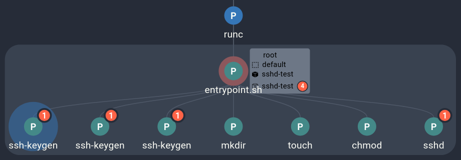

# MS-TA9010 - SSH Server Running Inside Container

## Pre-Requisites

Make sure the cluster is running and your Kubectl configuration is set up to access the cluster. If not, follow [these steps](../getting-started.md) to get started.

## Running the Exploit

All we need is an SSH server running - to start one, we can run:

```sh
kubectl run sshd-test --image kubernetesio/sshd-jumpserver
```

And monitor the deployment to make sure the pod starts up without issue:

```sh
kubectl get pods
```

## Investigating the Results

After the pod and container start up, Spyderbat will quickly detect the issue, and the data should be processed and available through the console soon after. Once the data is available, starting an investigation is as simple as searching for the event:

- In the Spyderbat Console, navigate to the search page.
- In the search builder, select the "Redflag" event, and open the query builder.
- Select "Description" in the field dropdown, "~=" (Matches Pattern) in the comparison dropdown, and enter "SSH*" for the value. This will search for all flags with a description that starts with "SSH". Alternatively, enter the query directly into the search field: `description ~= "SSH*"`. 
- The default time range (covering the past hour) is more than enough, so we can now start the search.

To investigate the Kubernetes context related to the event, select the relevant flags in the results and click "Start Kubernetes investigation" near the bottom of the page. If you are more interested in the process-level context, click "Start Process investigation" instead.



## Next Steps

After investigating the root cause of the newly-detected red flag, we can take steps to contain and eradicate the issue.

- In the Kubernetes investigation, find the pod name whose descendant triggered the red flag.
- Using the details pane below the graph, copy the name of the offending pod
- Use kubectl to remove the pod:

```sh
kubectl delete pod sshd-test
```

