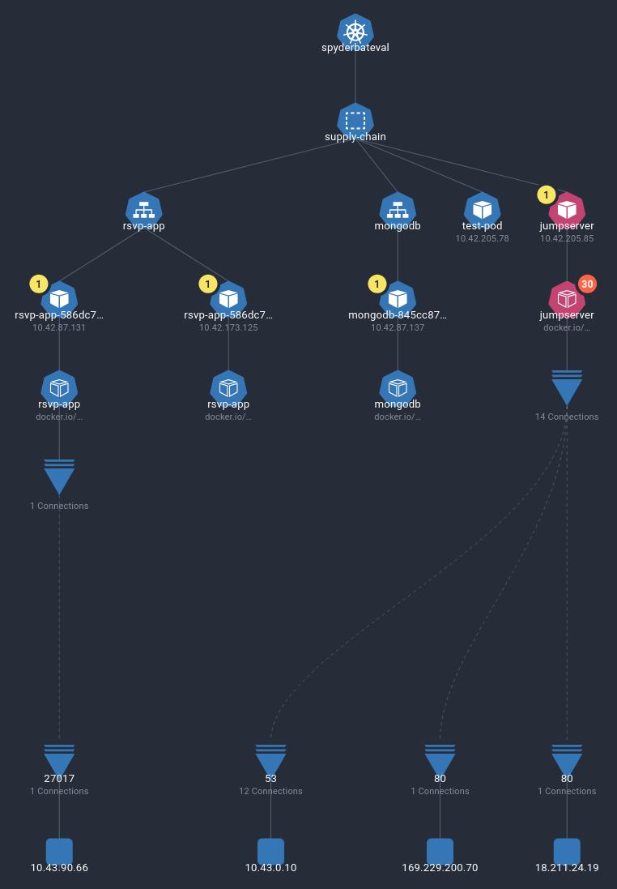

# Cluster Policies — Rogue Image

In this scenario, an attacker gains pod creation permissions on the Kubernetes cluster. Using kubectl, they start up a new pod with scanning and exploitation tools to try and gain further access. However, we will define a [Cluster Ruleset Policy](https://docs.spyderbat.com/concepts/guardian/ruleset_policies) that will detect and kill the new pod, as well as generating a flag for it.

## Pre-Requisites

* [Install Spyctl](https://docs.spyderbat.com/installation/spyctl)
* [Configure Spyctl with a Context](https://docs.spyderbat.com/installation/spyctl/spyctl-initial-configuration)

## Setup

To detect a pod with a disallowed image, we first need to define what is and isn't allowed. Luckily, instead of manually defining each image that is or isn't allowed, we can use `spyctl` to generate the definition from a known-good version of the cluster.

First, list off the Clusters tracked by Spyderbat:

```sh
spyctl get clusters
```

For example:
```
$ spyctl get clusters
Getting clusters
NAME              UID               CLUSTER_ID                            FIRST_SEEN            LAST_DATA
spyderbateval     clus:xxxxxxxxxxx  XXXXXXXX-XXXX-XXXX-XXXX-XXXXXXXXXXXX  2024-07-30T15:37:48Z  2024-07-31T13:37:48Z
```

Next, create a new cluster policy. This command generates a definition for a new policy generated from recently seen images within each namespace.

```sh
spyctl create cluster-policy -C spyderbateval --namespace -n demo-cluster-policy > cluster-policy.yaml
```

By default, Cluster Policies have a single response action: `makeRedFlag`. This action generates a redflag that references a deviant object. Redflags are used to populate security dashboards within the Spyderbat Console, but may also be forwarded to a SIEM and/or used to trigger notifications.

In this case, however, we want to take advantage of a different feature: "Interceptor" response actions. A cluster policy rule can be configured to trigger the `agentKillPod` response action, which will kill the pod of any violating container in the matching namespace. In this case, we want to add extra protections to the `supply-chain` namespace, as if we have some important services there. To do this, edit the generated yaml as follows:

```yaml
# ...
# near the bottom of the file:
- apiVersion: spyderbat/v1
  kind: SpyderbatPolicy
  metadata:
    name: demo-cluster-policy
    type: cluster
  spec:
    enabled: true
    mode: audit
    clusterSelector:
      matchFields:
        name: spyderbateval
    rulesets:
    - spyderbateval_ruleset
    response:
      default:
      - makeRedFlag:
          severity: high
    actions: # <--- edit these lines \/
    - agentKillPod:
        namespaceSelector:
          matchLabels:
            kubernetes.io/metadata.name: supply-chain
```

Note that the `mode` for the policy is set to `audit`: this means that the policy will not take any action yet, but will instead create logs that show what actions would have been taken if the policy was in `enforce` mode.

Next, we can apply the finished policy:

```sh
spyctl apply -f cluster-policy.yaml
```

To confirm that your policy applied successfully you can run the following command:
```sh
spyctl get policies --type cluster
```

And to view your cluster-rulesets you can run this command:
```sh
spyctl get rulesets --type cluster
```

To test that the policy is actually doing what we expect, lets track the audit logs:

```sh
spyctl logs --follow policy demo-cluster-policy
```

In another terminal, trigger a log by creating a new pod that is not in the allowlist:

```sh
kubectl run --namespace supply-chain test-pod --image busybox --rm -i --restart='Never' -- sh
```

You should soon see new logs printed by the `spyctl logs` command:

```
(audit mode): Container image "docker.io/library/busybox:latest" ns:"supply-chain" cluster:"spyderbateval" deviated from policy "demo-cluster-policy".
(audit mode): Would have initiated "agentKillPod" action for "test-pod" pod. Not initiated due to "audit" mode.
(audit mode): Would have initiated "makeRedFlag" action for "cont:xxxxxxxxxxx:yyyyyyyyyyy:zzzzzzzzzzzz". Not initiated due to "audit" mode.
```

Now, we can edit the policy to enable enforcement:

```sh
spyctl edit policy demo-cluster-policy
```

```yaml
# Please edit the object below. Lines beginning with a '#' will be ignored,
# and an empty file will abort the edit. If an error occurs while saving this file will be
# reopened with the relevant failures.
#
apiVersion: spyderbat/v1
kind: SpyderbatPolicy
metadata:
  ...
spec:
  clusterSelector:
    matchFields:
      name: spyderbateval
  enabled: true
  mode: enforce # <--- change this from audit to enforce
  response:
    actions:
    - agentKillPod:
        namespaceSelector:
          matchLabels:
            kubernetes.io/metadata.name: supply-chain
    default:
    - makeRedFlag:
        severity: high
  rulesets:
  - spyderbateval_ruleset
```

## Running the Exploit

Now that we have a policy configured, let's simulate an attack. Assuming an attacker manages to get `kubectl` access to the cluster enough to be able to exec and create a pod, they may try and access an existing container and run commands from there. However, many container images are stripped-down, meaning common tools like `nmap` or even `curl` may not be available.

Instead, an attacker with create access could spin up a new pod with a container that includes all of these tools by default, such as [kalilinux/kali-rolling](https://www.kali.org/docs/containers/official-kalilinux-docker-images/).

```sh
# run the kalilinux image, attaching to it when it is ready
# here we are using the supply-chain namespace just for the purposes of the demo
kubectl run --namespace supply-chain jumpserver --image kalilinux/kali-rolling -i
```

Once that attaches, we need to install the kali tools with:

```sh
apt update && apt -y install kali-linux-headless
```

However, this command never gets a chance to finish, as the pod is quickly detected and killed by the new policy. Checking the list of pods reveals that it is no longer present in that namespace:

```
$ kubectl get pods -n supply-chain
NAME                        READY   STATUS    RESTARTS        AGE
mongodb-845cc87dcc-9wj6n    1/1     Running   0               5d23h
rsvp-app-586dc76544-bbtqw   1/1     Running   0               5d23h
rsvp-app-586dc76544-pndzc   1/1     Running   1 (5d19h ago)   5d23h
```

## Investigation

Just because the pod was killed doesn't mean there isn't any record of it. The cluster policy is also configured to generate a high severity flag when the policy is violated.

To begin the investigation, navigate to the Dashboard page in the Spyderbat. In the Policy tab, under "Container Policy Deviation Flags", there should be a new entry in the `demo-cluster-policy` group. Select the flag in this group, and select "Start Kubernetes Investigation" at the bottom of the page. This will open the Kubernetes view in a new tab, displaying all pods and containers in the `supply-chain` namespace. Here, we can see that a new pod appeared that is not in any namespace, and made a large number of connections to Kali linu package repositories. In the details view, we can also see the image used: `kalilinux/kali-rolling:latest`.

If the flagged pod does not immediately show up, try adjusting the time bar at the top of the graph view further back; this will show and hide pods that existed during those times as they were created and deleted. You may even notice our test pod popping up in the history.



From here, we can drill down into the container by right-clicking it on the graph and selecting "Investigate Container". This will open a process-level causal tree, allowing us to see exactly what was executed inside the jumpserver pod.


The `apt` command generated quite a few child processes (you may see a slightly different set of processes); to clean these up we can right-click the parent of any irrelevant process and remove its descendants from the trace. On the other hand, if we want to see more of the related processes, we can right click and select the objects we want to add.

## Next Steps

Now that we have determined the scope of the attackers actions, it is clear that only the package install command was run, and no other resources were accessed. Since the pod was already deleted, the only remaining steps we need to take are determining how the `kubectl run` access was obtained in the first place.

## Clean-up

To make sure this demo can be easily run again, make sure to remove the policy:

```sh
spyctl get policies --type cluster
```

```
UID                       NAME                 STATUS     TYPE       VERSION  CREATE_TIME
pol:xxxxxxxxxxxxxxxxxxxx  demo-cluster-policy  Enforcing  cluster          1  2024-07-31T14:36:30Z
```

```sh
spyctl delete policy demo-cluster-policy
```

And the associated ruleset:

```sh
spyctl get rulesets --type cluster
```

```
UID                      NAME                   TYPE       VERSION  CREATE_TIME              LAST_UPDATED
rs:xxxxxxxxxxxxxxxxxxxx  spyderbateval_ruleset  cluster          1  2024-07-31T14:36:29 UTC  2024-07-31T14:36:29 UTC
```

```sh
spyctl delete ruleset spyderbateval_ruleset
```

